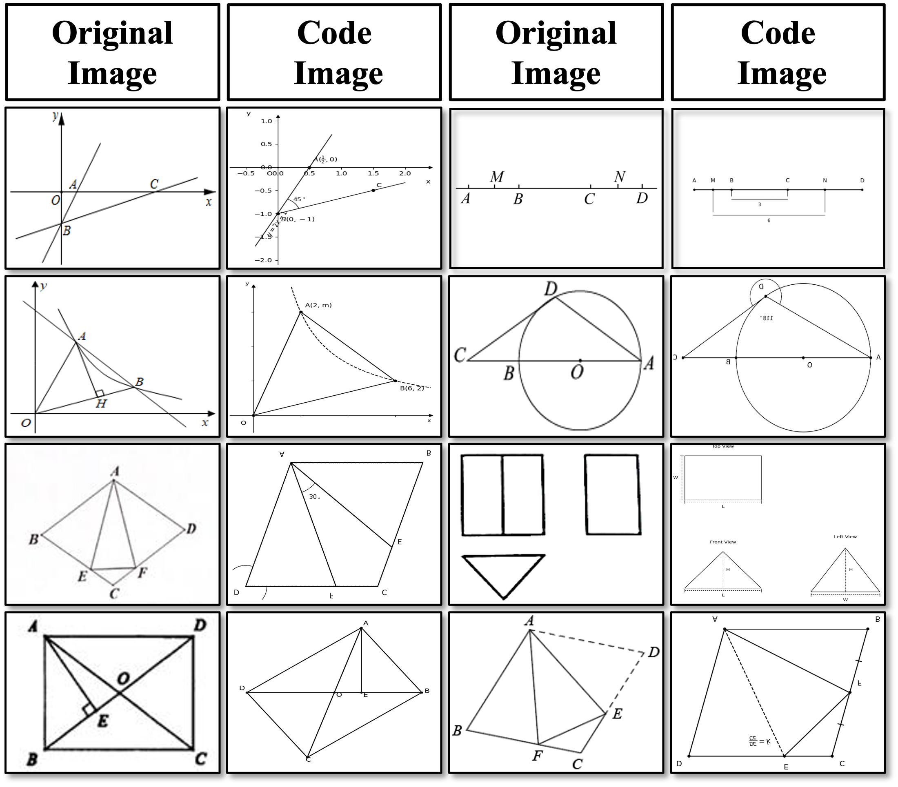

<div align='middle'>
<h1>Hard Negative Contrastive Learning for Fine-Grained Geometric Understanding in Large Multimodal Models</h1h1>

<h3></h3>

| [🤗 HF Dataset](https://huggingface.co/datasets/THU-KEG/MM-Math-Align) |
[📃 Paper]() |
</div>

We introduce **MMGeoLM**, a project designed to enhance the geometric problem-solving capabilities of Large Multimodal Models (LMMs). This work consists of three main components: (1) constructing a comprehensive geometric dataset, which includes image-text alignment data, image-based and text-based hard negatives, and supervised fine-tuning data; (2) training vision encoders with hard negatives to improve their perception of geometric elements; and (3) performing supervised fine-tuning of LMMs.


## Geometric Dataset

### Image-Text Alignment Dataset

<p align="center">
  
</p>


We release **MM-Math-Align**, a dataset built upon [**MM-Math**](https://huggingface.co/datasets/THU-KEG/MM_Math), which is derived from actual geometry questions used in middle school exams. Each sample contains the original geometric diagram, a Python script that approximately reconstructs the original diagram, a caption describing the positive image, 10 negative example Python scripts generated based on the positive image, and 10 corresponding negative example captions. The dataset consists of a total of 4,021 samples.

The Hugging Face dataset download link for MM-Math-Align: [🤗 HF Dataset](https://huggingface.co/datasets/THU-KEG/MM-Math-Align)

### Dataset Construction Script


If you want to construct your own image-text alignment data for your geometry dataset, you can follow the steps below:

1. First, run the [code_generation.py](./Hard_Negatives_Construction/code_generation.py) script. The input should be the **geometry question** and its corresponding **answer**, which will be used to generate a geometric diagram similar to the original one. We recommend using the [gemini-2.5-pro-preview](https://deepmind.google/models/gemini/pro/?_gl=1*1sm6xx9*_up*MQ..*_ga*MTYwMzEzNjI5Ni4xNzQ4MDg3NjY1*_ga_LS8HVHCNQ0*czE3NDgwODc2NjQkbzEkZzAkdDE3NDgwODc2NjQkajAkbDAkaDA.) model, as it has strong mathematical reasoning and coding capabilities.
2. Next, after generating the geometric image script, use [re_verification.py](./Hard_Negatives_Construction/re_verification.py) to perform a secondary verification. After running it through your local system, you will obtain a geometric diagram similar to the original one.
3. For constructing negative captions of the geometric diagrams, please refer to the [prompt](./Hard_Negatives_Construction/promts.py) settings provided in [prompts.py](./Hard_Negatives_Construction/promts.py). This prompt has been tested and can run stably in practice.
4. The scripts support multi-threaded execution for fast data construction. However, please be mindful of token usage, as the scripts require a model API key.
### TODO

- [ ] Relase the hard text negatives data
- [ ] Relase the SFT geometric data


## Hard Negative Training

We modify the original CLIP training strategy to support  an arbitrary number of negative samples, rather than restricting within a batch. We provide two example scripts: [`run_negative_images.sh`](./Hard_Negative_Training/scripts/run_negative_images.sh) for image-based negatives and [`run_negative_texts.sh`](./Hard_Negative_Training/scripts/run_negative_text.sh) for text-based negatives.


The data format for image-based hard negatives is as follows:
```json
[
    {
        "positive_image_path": "/path/positive_image.png",
        "negative_image_path": ["/path/negative_image1.png","/path/negative_image2.png"], 
        "conversations" :{"from": "humam", "value": "describe the image"}, {"from": "gpt", "value": "Positive Caption."}
    },
]
```
The data format for text-based hard negatives is as follows:
```json
[
    {
        "positive_image_path": "/path/positive_image.png", 
        "negative_captions": ["Negative Caption 1","Negative Caption 2"],
        "conversations" :{"from": "humam", "value": "describe the image"}, {"from": "gpt", "value": "positive captions"} 
    }
]
```


## Supervised Fine-tuning

We adopt the Qwen2.5-7B-Instruct model as the backbone of our LMs. As for Mammoth2-7B mentioned in the paper, it can be trained following the [LLaVA-1.5](https://github.com/haotian-liu/LLaVA) training strategy.

**First Stage**: After training CLIP, we provide a training script for MLP. Please refer to [`pretrain_qwen2_5.sh`](./LLaVA-NeXT-Qwen2_5/scripts/pretrain_qwen2_5.sh). In this stage, both the vision encoder and LLM are frozen. In the script, conversation version must be configured with `--version qwen_1_5`; otherwise, errors may occur when training with the Qwen2.5 model.

**Second Stage**: In this stage, we involves training the entire multimodal architecture,  and we provide a training script [`finetune_qwen2_5.sh`](./LLaVA-NeXT-Qwen2_5/scripts/finetune_qwen2_5.sh). This script integrates the pre-trained MLP module and performs supervised fine-tuning on the full model.
## citation
```
@artical 
```


